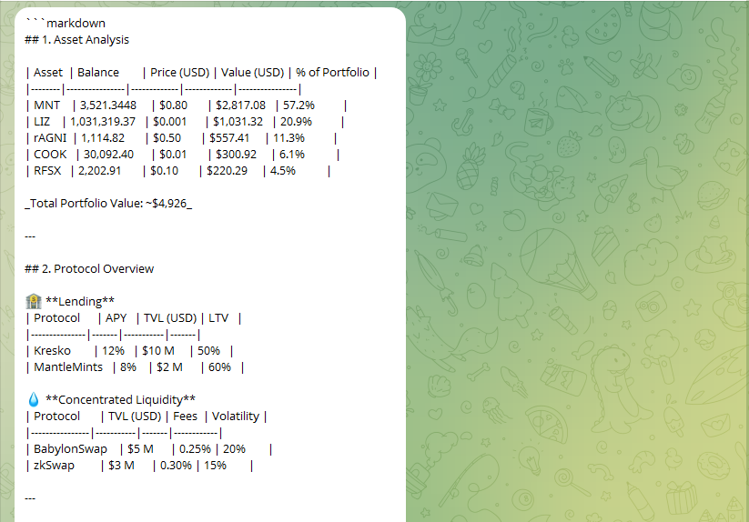
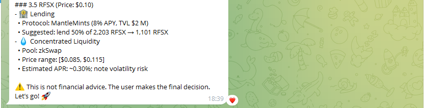

 # DeFiScout Mantle Agent

 AI-Assistant for analyzing wallets on the Mantle network.  
Collects data through Thirdweb, NebulaAPI, DefiLlama, CoinGecko and generates DeFi recommendations.

---

## Repository Structure
  - [defiscout-mantle-agent](defiscout-mantle-agent.json) - JSON export of the n8n workflow.
 - [AIAnalysis_promt](AIAnalysis_promt.txt) - prompt templates.
 -  [AIAsset Allocation_promt](AIAsset%20Allocation_promt.txt)- prompt templates
 
- `README.md` 
### Getting Started
1. Import `n8n-workflow.json` into n8n (Workflows → Import).  
2. Configure Credentials (Telegram Bot, NebulaAPI, DefiLlama, Etherscan).  
3. Run the workflow and send `/analyze_wallet <address>` in Telegram.

## Example Output
 
 
 